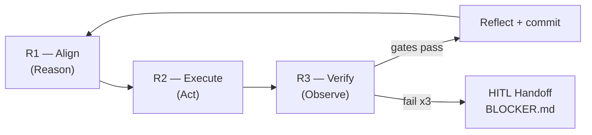

# AI Dev Protocol


**Production-tested framework for AI-assisted development.**

Rules + templates + tools that tell your AI agent how to work on your project.
Works with Claude Code, Codex, Gemini, Qwen, or any LLM.

---

## Quick Start

```bash
# Option A: CLI (recommended)
npx ai-dev-protocol init

# Option B: setup script
bash <(curl -fsSL https://raw.githubusercontent.com/irixzafra/ai-dev-protocol/main/setup.sh)

# Option C: manual
cp protocol/protocol.md        your-project/dev.protocol.md
cp templates/agent-config.template.md  your-project/CLAUDE.md
cp templates/lessons.template.md       your-project/planning/LESSONS.md
```

Then tell your agent:
```
Read dev.protocol.md before doing anything.
```

---

## If you're not a developer

You don't need to touch code to use this system.

```
[You — from the browser]
   → Open GitHub and create a ticket: "I want users to be able to reset their password"
   → Fill a simple form: what you want, who benefits, what shouldn't change

[The AI — on the server]
   → Reads your ticket
   → Asks for confirmation before touching anything
   → Implements the code, passes tests, closes the ticket

[You — the next morning]
   → See the ticket in "Done"
   → Review the result
   → Approve or request changes with a comment
```

> Complete guide for non-technical stakeholders: [`docs/stakeholders.md`](docs/stakeholders.md)

---

## The Problem

If you use AI to code, these 3 failures are familiar:

- **Builds what you didn't want** — assumed instead of asking
- **Repeats the same mistakes** — each session starts from zero
- **Says "done" and it's not** — no real verification

All 3 are solved with 3 minimal rules, applied consistently.

---

## How It Works

| Rule | What it does | Failure it prevents |
|---|---|---|
| **R1 — Align** | Write a spec, you approve, then code | Builds what you didn't want |
| **R2 — Remember** | Every correction is captured in a file the agent always reads | Same mistakes repeat |
| **R3 — Verify** | Type-check + tests + secrets before "done" | Broken code reaches the repo |

---

## CLI Commands

```bash
devox init [--level 0|1|2]  # Bootstrap project with protocol + templates + hooks
devox status                 # Show WORKBOARD + active claims + briefings
devox claim <task-id>        # Atomic claim via git (prevents agent collisions)
devox verify                 # Run all quality gates
devox report                 # Generate delivery format
devox briefing [show|create] # Manage agent briefings
```

---

## Structure

```
ai-dev-protocol/
├── protocol/                         <- the complete framework
│   ├── protocol.md                   <- core development loop (R1-R3)
│   ├── discovery.md                  <- auto-generate project playbook
│   ├── alignment.md                  <- structured interview process
│   ├── autonomous.md                 <- autonomous task execution
│   ├── briefings.md                  <- multi-agent session orchestration
│   ├── claims.md                     <- atomic anti-collision mechanism
│   ├── self-improvement.md           <- graduation + learning loop
│   ├── quality-flywheel.md           <- self-improving audit loop
│   └── framework/                    <- "El Camino" — 10 standard docs
│       ├── README.md                 <- overview, principles, 4 laws
│       ├── governance.md             <- owner control mechanisms
│       ├── backlog.md                <- intake, prioritization, sprints
│       ├── testing.md                <- 3-layer verification pipeline
│       ├── design-system.md          <- tokens, typography, layout
│       ├── api.md                    <- response contract, validation
│       ├── database.md               <- naming, migrations, RLS
│       ├── agents.md                 <- skills, multi-agent coordination
│       ├── deployment.md             <- deploy, rollback, secrets, Docker
│       └── spec-template.md          <- product spec template
│
├── packages/
│   ├── cli/                          <- CLI: npx ai-dev-protocol init
│   ├── mcp-server/                   <- MCP orchestrator for agent coordination
│   └── hooks/                        <- generic git hooks (secrets, scope, graduation)
│
├── skills/                           <- 17 domain-specific skills
│   ├── dev-architect/                <- strategic architecture + planning
│   ├── dev-builder/                  <- feature implementation
│   ├── dev-qa/                       <- quality gates + dogfooding
│   ├── dev-cycle/                    <- full lifecycle orchestration
│   ├── dev-debug/                    <- structured debugging
│   ├── dev-db/                       <- database operations
│   ├── dev-design/                   <- visual design system
│   ├── dev-ux/                       <- UX audit + heuristics
│   ├── dev-backend/                  <- backend patterns + auth
│   ├── dev-browser/                  <- Playwright automation
│   ├── dev-docs-governor/            <- documentation governance
│   ├── dev-update/                   <- dependency management
│   ├── dev-security/                 <- OWASP Top 10
│   ├── dev-architecture/             <- ADR/PDR patterns
│   ├── dev-performance/              <- waterfalls, bundle, lists
│   ├── dev-testing-strategy/         <- behavior tests
│   └── dev-accessibility/            <- WCAG 2.1 AA
│
├── adapters/                         <- per-model overrides
│   ├── universal-core.md             <- 6 rules all agents follow
│   ├── claude.md, codex.md, gemini.md, qwen.md
│
├── templates/                        <- project bootstrap files
│   ├── agent-config.template.md      <- CLAUDE.md starting point
│   ├── lessons.template.md           <- corrections inbox
│   ├── dev-log.template.md           <- session memory
│   ├── workboard.template.md         <- task tracking + autonomous queue
│   ├── briefings.template.md         <- multi-agent briefings
│   ├── coordination.template.md      <- agent coordination
│   ├── playbook.template.md          <- project SSOT
│   ├── spec.template.md              <- product spec
│   ├── adr.template.md, pdr.template.md, program.template.md
│   └── feature-request.issue.md      <- GitHub issue for non-techs
│
├── benchmark/                        <- protocol quality tests (B01-B10)
├── examples/                         <- real-world examples
├── docs/                             <- guides and references
├── setup.sh                          <- quick setup script
└── package.json                      <- workspace root
```

---

## Industry Nomenclature

| This protocol | File | Industry standard (2024-2026) |
|---|---|---|
| Agent entry point | `CLAUDE.md` / `AGENTS.md` | Workspace Rules (`.cursorrules`, `.windsurfrules`) |
| Accumulated learning | `LESSONS.md` | **Semantic Memory** |
| Session memory | `DEV_LOG.md` | **Episodic Memory** |
| Emergency brake | `BLOCKER.md` | **HITL Handoff** (Human-in-the-Loop) |
| Domain skills | `skills/dev-*/` | **MCP / Static Tools** |
| Main loop | R1 → R2 → R3 | **ReAct Loop** (Reason → Act → Observe) |



---

## IDE Compatibility

| Tool | Config file |
|---|---|
| Claude Code | `CLAUDE.md` |
| Cursor | `.cursorrules` |
| Windsurf | `.windsurfrules` |
| GitHub Copilot | `.github/copilot-instructions.md` |
| Codex / OpenAI | `AGENTS.md` |
| Gemini | `GEMINI.md` |
| Any agent | load `dev.protocol.md` as system prompt |

Model adapters: [`adapters/`](adapters/)

---

## Comparison

| Problem | Boris Cherny (6 rules) | karpathy | This protocol |
|---|---|---|---|
| AI builds wrong thing | plan mode | - | structured alignment interview |
| Lessons disappear | update CLAUDE.md | - | graduation system + pre-commit gate |
| 4 agents colliding | - | - | atomic claim mechanism |
| Generic AI-looking UI | - | - | Uncodixify (10 patterns + alternatives) |
| Autonomous optimization loops | - | ML only | program.md (any system) |
| Mid-session corrections lost | only at close | - | zero-latency capture |
| Works with multiple LLMs | - | - | per-model adapters |
| Progressive adoption | - | - | start with 3 files |

> Full analysis: [`docs/inspirations.md`](docs/inspirations.md)

---

## Tested in Production

- Next.js 15 monorepo with strict TypeScript
- 4 concurrent agents: Claude Code, Codex, Gemini, Qwen
- 1700+ tests, 9 quality gates in pre-commit
- Multi-tenant SaaS in beta

---

## Contributing

Every pattern here comes from real production use.

- **New skill:** open an issue with the "New skill suggestion" template
- **Protocol improvement:** issue with "Protocol improvement"
- **The issue is the spec. The PR is the implementation.**

---

## License

MIT
